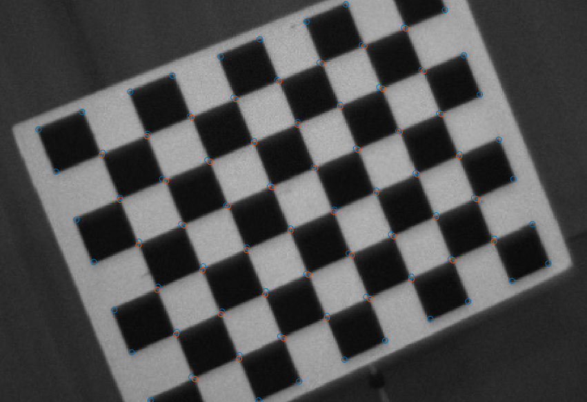

# MatLab-Camera-Calibration
Estimates the pose of a camera given the intrinsic calibration and an image containing a checkerboard pattern.

USAGE: 

1. Call function cross_junctions(I, boundPoly, Wpts) with an input image, ROI, and world points of each cross junction:

- harris corner detection to detect corners in image 
- non-maximal suppression to get one feature point per corner (blue circles in image)
- saddle point detection to refine cross-junctions and remove false positives. (orange circles in image)

2. Call fuction pose_estimate_nlopt(Eg, Ipts, Wpts) with first guess for camera pose, previously found saddle points, and world points of cross junction.
- Nonlinear least squares using jacobian of each image plane point wrt camera pose matrix
